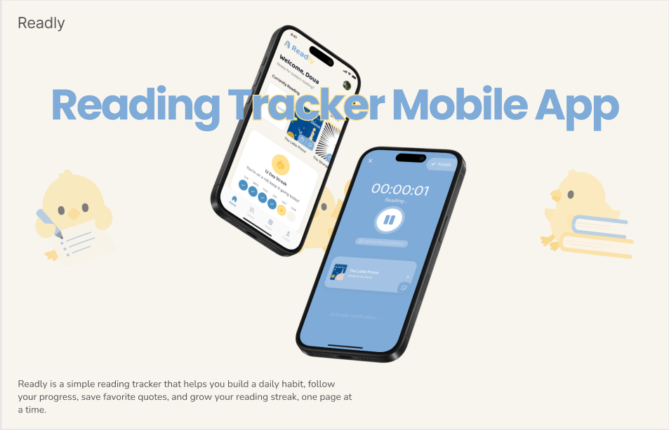

# 📖 Readly

### Build a better reading habit.

A distraction-free reading tracker that helps users manage their
personal library, track reading progress, record reading sessions,
set reading goals, and capture notes along the way.

<p align="center">
  
</p>

<p align="center">
  
  
  
  
</p>

---

## ✨ Features

- 🔐 Email/Password and Google authentication
- 📚 Personal library management
- 🔍 Search books using the Open Library API
- ✍️ Add books manually
- 📖 Track reading progress
- ⏱️ Start, pause, resume, and complete reading sessions
- 📝 Create and manage notes while reading
- 🎯 Set daily reading goals
- 📊 Track reading statistics and completed books
- 👤 Manage user profile

---

## 📱 App Preview

> Screenshots of the application.

<p align="center">
  
  
  
  
</p>

<p align="center">
  <!-- 
   -->
  
</p>

---

## 🏗️ Architecture

Readly follows a feature-based architecture with a clear separation
between presentation, business logic, and data layers.

```text
lib/
├── core/
│   ├── constants/
│   ├── dependency_injection/
│   ├── network/
│   ├── routing/
│   └── theme/
│
└── features/
    ├── auth/
    ├── home/
    ├── library/
    ├── search_book_api/
    ├── search_book_details_api/
    ├── reading_session/
    ├── notes/
    ├── profile/
    └── splash/

Each feature is organized into:

feature/
├── data/
├── model/
├── business_logic/
└── presentation/


# 🔄 State Management

Readly uses **Cubit** from `flutter_bloc` for state management.

The application follows a layered architecture where each layer has a clear responsibility:

```text
UI
 ↓
Cubit
 ↓
Repository
 ↓
Web Service / Firebase / API
```

* **UI** — Displays the application and handles user interactions.
* **Cubit** — Manages feature-specific application state and coordinates UI updates.
* **Repository** — Separates business logic from the underlying data sources.
* **Web Service / Firebase / API** — Handles communication with external and cloud data sources.

This structure helps keep the application **maintainable, testable, and easy to extend**.

---

# 🔎 Book Search Strategy

Readly uses the **Open Library API** in two stages to provide an efficient book-search experience.

## 1. Search

The search endpoint retrieves lightweight information required to display book results:

```text
Title
Author
Cover
Edition Key
Approximate Page Count
```

## 2. Book Details

When a user selects a book, Readly retrieves additional metadata using the book's **Work** and **Edition** endpoints.

```text
Search API
     ↓
Basic Book Information
     ↓
User Selects Book
     ↓
Work Endpoint + Edition Endpoint
     ↓
Book Details
     ↓
Confirm & Add to Library
```

This approach keeps search results lightweight while loading detailed information **only when it is needed**.

---

# ⏱️ Reading Sessions

Reading sessions are tracked using a **live stopwatch** that records the amount of time spent reading.

```text
Start
  ↓
Reading
  ↓
Pause / Resume
  ↓
Add Note (Optional)
  ↓
Continue Reading
  ↓
Finish Session
  ↓
Update Reading Progress
  ↓
Save Session
```

When a user opens the note screen during an active reading session, the timer continues running. Note-taking is therefore considered part of the **overall reading session**.

Once a session is completed, Readly stores:

* Reading duration
* Pages read
* Session timestamp
* Updated book progress

This data is then used to build the user's **reading history and statistics**.

---

# 🔥 Data Consistency

Completing a reading session updates two related pieces of data:

* The book's **reading progress**
* The **reading session history**

These Firestore operations can be handled as a **single atomic batch**, preventing partial updates and keeping book progress consistent with session statistics.

```text
Firestore Batch
├── Update Book Progress
└── Create Reading Session
        ↓
     Commit
        ↓
Both succeed or neither is applied
```

Using an atomic batch ensures that the application does not end up with an updated book progress while the corresponding reading session was not successfully recorded.

---

# 🛠️ Tech Stack

| Technology                  | Purpose                        |
| --------------------------- | ------------------------------ |
| **Flutter**                 | Mobile application development |
| **Dart**                    | Programming language           |
| **flutter_bloc / Cubit**    | State management               |
| **Firebase Authentication** | User authentication            |
| **Cloud Firestore**         | Cloud database                 |
| **Supabase Storage**        | Profile image storage          |
| **Dio**                     | HTTP client                    |
| **Open Library API**        | Book search and metadata       |
| **GoRouter**                | Application navigation         |

---

# 🗂️ Firestore Structure

Readly organizes user-related data under the authenticated user's document.

```text
users
 └── {uid}
      ├── user information
      │
      └── books
           └── {bookId}
                ├── book metadata
                │
                ├── reading_sessions
                │    └── {sessionId}
                │
                └── notes
                     └── {noteId}
```

This structure keeps each user's books and their related **reading sessions and notes** organized within their own user data.

---

# 🚀 Getting Started

## 1. Clone the Repository

```bash
git clone https://github.com/YOUR_USERNAME/readly.git
cd readly
```

## 2. Install Dependencies

```bash
flutter pub get
```

## 3. Run the Application

```bash
flutter run
```

> **Note:** Firebase configuration files and Supabase configuration must be properly configured before running the application.

---

# 🌿 Development Workflow

The project was developed using a **feature-based Git branching workflow**.

```text
main
├── feature/auth
├── feature/home
├── feature/library
├── feature/search
├── feature/reading-session
├── feature/notes
└── feature/profile
```

Each major feature was developed in its own branch before being integrated into the main application.

This workflow helped keep feature development isolated and made it easier to manage changes throughout the development process.
