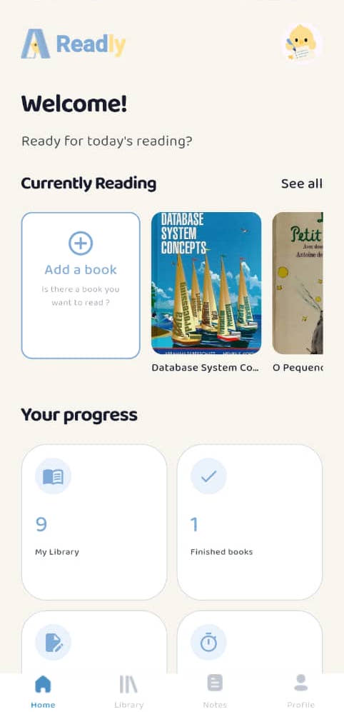
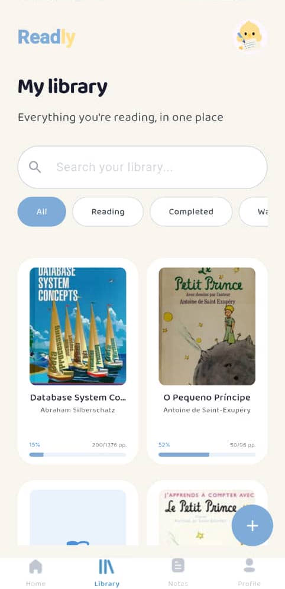
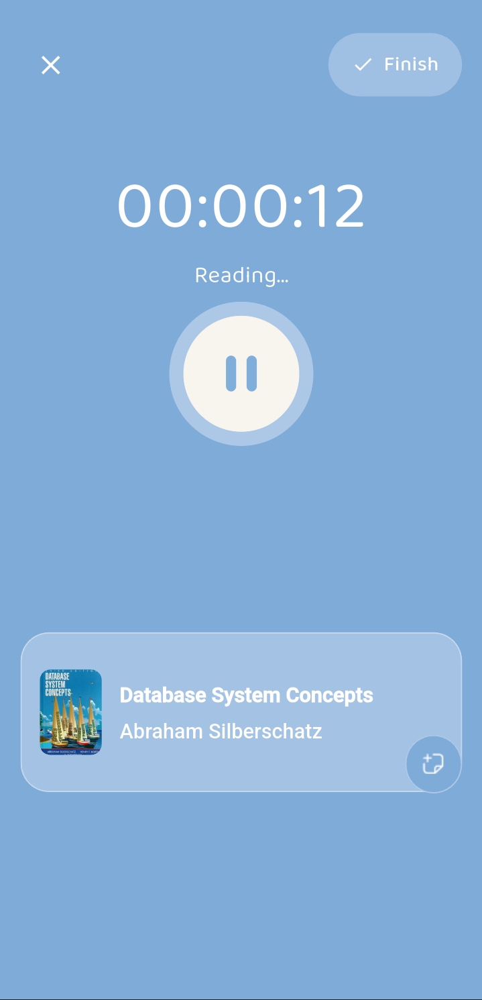
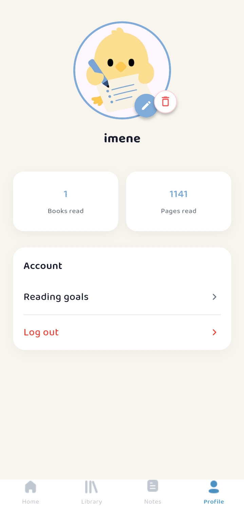
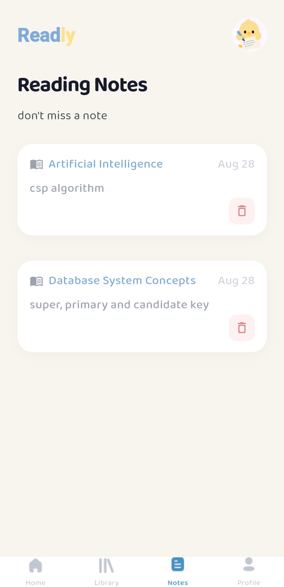

# 📖 Readly

### Build a better reading habit.

A distraction-free reading tracker that helps users manage their
personal library, track reading progress, record reading sessions,
set reading goals, and capture notes along the way.

<p align="center">
  
</p>

<p align="center">
  
  
  
  
</p>

---

## ✨ Features

- 🔐 Email/Password and Google authentication
- 📚 Personal library management
- 🔍 Search books using the Open Library API
- ✍️ Add books manually
- 📖 Track reading progress
- ⏱️ Start, pause, resume, and complete reading sessions
- 📝 Create and manage notes while reading
- 🎯 Set daily reading goals
- 📊 Track reading statistics and completed books
- 👤 Manage user profile

---

## 📱 App Preview

> Screenshots of the application.

<p align="center">
  
  
  
  
</p>

<p align="center">
  <!-- 
   -->
  
</p>

---

## 🏗️ Architecture

Readly follows a feature-based architecture with a clear separation
between presentation, business logic, and data layers.

```text
lib/
├── core/
│   ├── constants/
│   ├── dependency_injection/
│   ├── network/
│   ├── routing/
│   └── theme/
│
└── features/
    ├── auth/
    ├── home/
    ├── library/
    ├── search_book_api/
    ├── search_book_details_api/
    ├── reading_session/
    ├── notes/
    ├── profile/
    └── splash/


Each feature is organized into:

feature/
├── data/
├── model/
├── business_logic/
└── presentation/